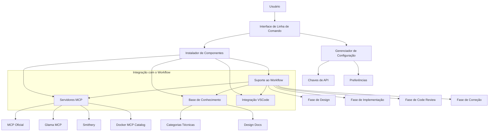

# **Frank-MCP**

Documento de Projeto

*Baseado em Project Charter & Technical Design Document*  
**Versão:** 2.1  
**Status:** Em Desenvolvimento  

---

## **1. Visão Geral**  

### **1.1 Resumo do Projeto**  

**Objetivo:** Desenvolver uma ferramenta de configuração automatizada para ambientes de desenvolvimento com servidores MCP (Model Context Protocol) e base de conhecimento especializada para profissionais de backend e DevOps, com suporte integrado ao workflow institucional.

**Escopo:**

- Instalação e configuração de múltiplos servidores MCP
- Criação de base de conhecimento estruturada (incluindo Design Docs)
- Integração com VSCode e suporte ao workflow de desenvolvimento (Design Docs -> Implementação -> Code Review -> Correção)
- Suporte inicial para Ubuntu 22.04.5

**Metas:**

- Entregar uma POC funcional em 3 dias
- Simplificar o processo de configuração de ambiente MCP
- Otimizar o workflow de desenvolvimento para aumentar produtividade
- Fornecer base para expansão futura do projeto

### **1.2 Justificativa**

A configuração manual de servidores MCP e bases de conhecimento é um processo complexo e propenso a erros. Esta ferramenta automatiza esse processo, permitindo que desenvolvedores aproveitem rapidamente os benefícios dos LLMs em seu fluxo de trabalho, com acesso a conhecimento especializado e documentação de projetos internos. Além disso, a integração com o workflow institucional permite aumentar a produtividade sem comprometer a qualidade técnica e diminuir a curva de aprendizado e adaptação dos novos membros do time.

### **1.3 Entregas do Projeto**  

| Entrega | Descrição | Prazo |
|---------|-----------|-------|
| POC Inicial | Versão mínima funcional para validação de conceito | 30 dias |
| MVP Funcional | Versão com funcionalidades essenciais homologada | 90 dias |
| Documentação de Uso | Guia de instalação e uso da versão MVP | 100 dias |
| Pacote de Distribuição | Script de instalação para Ubuntu | 120 dias |

---

## **2. Especificação Técnica**  

### **2.1 Arquitetura**

**Integração da Arquitetura com o Workflow:** O instalador configura os servidores MCP, a base de conhecimento e o VSCode para suportar o workflow de desenvolvimento.  A CLI interage com esses componentes para fornecer prompts e funcionalidades específicas para cada fase do workflow (Design, Implementação, Code Review e Correção), utilizando a base de conhecimento como fonte de informação.

### **2.2 Componentes Principais**

#### 2.2.1 Interface de Linha de Comando

- Interface interativa usando Rich/Typer para Python
- Menus de seleção para componentes e configurações
- Feedback visual durante instalação

#### 2.2.2 Instalador de Servidores MCP

- Suporte para múltiplas implementações de MCP
- Configuração automatizada com parâmetros do usuário
- Gerenciamento de dependências (Docker, etc.)

#### 2.2.3 Base de Conhecimento

- Estrutura de diretórios organizada por categorias
- Templates e exemplos para Design Docs

- Metadados para melhor recuperação de informações

#### 2.2.4 Integração com VSCode

- Configuração automática do editor
- Instalação de extensões relevantes
- Criação de workspace pré-configurado

#### 2.2.5 Suporte ao Workflow

- Prompts especializados para cada fase do workflow, utilizando a base de conhecimento.
- Integração com ferramentas de revisão de código (ex: GitHub, GitLab).
- Templates para documentação e revisão.

### **2.3 Requisitos Técnicos**

#### 2.3.1 Requisitos de Sistema

- Ubuntu 24.04.2 LTS
- Python 3.8+
- Docker e Docker Compose
- git
- Github/Gitlab CLI
- Gitflow
- Kubectl
- VSCode

#### 2.3.2 Dependências

- Rich (interface de terminal)
- Requests (comunicação HTTP)
- PyYAML (manipulação de arquivos de configuração)

---

## **3. Plano de Implementação**  

### **3.1 Fases do Projeto**

#### Fase 1: POC (30 dias)

- Implementação da CLI básica
- Suporte a pelo menos um servidor MCP
- Estrutura básica da base de conhecimento
- Integração simples com VSCode

#### Fase 2: MVP (60 dias após a POC)

- Suporte a servidores MCP adicionais
- Expansão da base de conhecimento com conteúdo relevante
- Melhorias na interface de usuário com base no feedback da POC
- Implementação completa do workflow (Design -> Implementação -> Review -> Correção)
- Testes unitários e de integração
- Homologação da versão MVP

#### Fase 3: Refinamento (pós-MVP)

- Testes e correções de bugs
- Otimização de performance
- Coleta de feedback para futuras versões

#### Fase 4: Distribuição (futuro)

- Empacotamento para repositórios Debian/Ubuntu
- Documentação completa e pública
- Suporte a distribuições Linux adicionais

### **3.2 Cronograma da POC**

| Dia | Atividades |
|-----|------------|
| 1-10 | Estrutura básica do projeto, CLI e instalador de MCP |
| 11-20 | Base de conhecimento, estrutura de Design Docs e configuração inicial do workflow |
| 21-30 | Integração com VSCode, implementação do suporte ao workflow e testes finais da POC |

---

## **4. Estrutura da Base de Conhecimento e Workflow de Desenvolvimento**  

### **4.1 Categorias Técnicas**

- **Arquitetura**: Padrões, princípios e práticas de arquitetura de software
- **LLMs**: Fundamentos, modelos e aplicações de Large Language Models
- **DevOps**: Ferramentas, práticas e fluxos de trabalho de DevOps
- **Python/Java/Go**: Recursos específicos de linguagens de programação
- **Cloud**: Serviços e configurações de nuvem (AWS, GCP, Azure)
- **Melhores Práticas**: Guias e recomendações gerais

### **4.2 Design Docs**

Estrutura hierárquica para documentação de design de projetos:

- **Geral**: Documentação Técnica para qualquer projeto desenvolvido dentro do time/empresa
- **Por Projeto**: Organização principal por projeto/produto

- **Tipos de Documentos**:
  
- Documentação de Requisitos e Produtos
  - FRD (Functional Requirements Document)
  - PRD (Product Requirements Document)
  - TRD (Technical Reference Document)
  - User Stories e Epics
- Decisões Técnicas
  - ADR (Architecture Decision Record)
  - RFC (Request for Comments)
- Diretrizes de Egenharia (Engineering Guidelines)
  - Padrões de Código
  - Boas Práticas de Desenvolvimento
  - Security Design Doc
  - Code Review
  - Testing
  - CI/CD
- Design e Arquitetura
  - System Design Docs (Higgh-level Design)
  - LLD (Low-level Design)
  - Modelos C4
  - Diagramas UML
- Operações e Infraestrutura
  - Runbook
  - Playbook
  - Infraestrutura Design Doc
- UML

- **Metadados**: Status, autores, datas, tags

### **4.3 Templates**

Templates padronizados para diferentes tipos de documentação:

- **Template de Arquitetura**: Visão geral, componentes, interfaces
- **Template de API**: Endpoints, parâmetros, exemplos
- **Template de ADR**: Contexto, decisão, consequências
- **Template de Diagrama**: Diferentes visualizações do sistema

### **4.4 Workflow de Desenvolvimento e Integração com a Base de Conhecimento**

O ambiente suporta o workflow institucional de desenvolvimento "Design Docs → Implementação → Code Review → Correção", otimizando cada fase com prompts, ferramentas específicas e informações da base de conhecimento:

#### 4.4.1 Design Docs

- Prompts para geração e revisão de documentação técnica, utilizando os templates da seção 4.3 e as categorias técnicas da seção 4.1.
- Integração com ferramentas de diagramação (ex: Mermaid, PlantUML).
- Validação de completude e consistência com base nas diretrizes da base de conhecimento.

#### 4.4.2 Implementação

- Prompts para geração de código baseado nos Design Docs, utilizando as informações das categorias "Python/Java/Go" e "Melhores Práticas" da base de conhecimento.
- Verificação de aderência a padrões de código com linters (ex: pylint, flake8).
- Sugestões de otimização e boas práticas com base no conteúdo da base de conhecimento.

#### 4.4.3 Code Review

- Prompts para análise automática de código, com suporte a ferramentas como SonarQube.
- Checklists personalizadas por tipo de projeto, definidas na base de conhecimento.
- Integração com plataformas de Code Review como GitHub e GitLab.
- Detecção de problemas comuns e sugestões de melhoria com base nas melhores práticas da base de conhecimento.

#### 4.4.4 Correção

- Prompts para resolução de problemas identificados no Code Review, com acesso à documentação e exemplos da base de conhecimento.
- Verificação de completude das correções com base nos comentários da revisão.
- Validação contra requisitos originais descritos nos Design Docs.

---

## **5. Riscos e Mitigações**  

| Risco | Impacto | Mitigação |
|-------|---------|-----------|
| Incompatibilidade com versões específicas do Ubuntu | Médio | Testar em diferentes versões (20.04, 22.04, 24.04), documentar requisitos específicos e fornecer scripts de adaptação. |
| Mudanças nas APIs dos servidores MCP | Alto | Implementar verificações de versão, design modular para facilitar atualizações e abstrair as APIs dos servidores MCP. |
| Problemas de permissão no Docker | Médio | Verificações claras e instruções para configuração de grupos e permissões no Docker, incluindo exemplos de comandos. |
| Limitações de hardware para modelos locais | Baixo | Documentar requisitos mínimos de hardware, priorizar modelos em nuvem na POC e oferecer opções de configuração para diferentes capacidades de hardware. |
| Incompatibilidade com workflow institucional | Alto | Validação prévia com especialistas da equipe de desenvolvimento através de entrevistas e análise de documentação do workflow atual.  O design da ferramenta será modular e configurável para permitir adaptações a diferentes workflows, com opções para customizar prompts e integrações.  Será criado um módulo de configuração específico para o workflow, permitindo ajustes finos sem modificar o código-fonte da ferramenta. |

---

## **Anexos**  

### **A. Bibliografia**  

#### Arquitetura & Design

- Gamma et al. "Design Patterns: Elements of Reusable Object-Oriented Software" (1994)
- Robert C. Martin. "Clean Code" (2008)  
- Eric Evans. "Domain-Driven Design" (2003)  
- Robert C. Martin. "Clean Architecture" (2017)  
- Vaughn Vernon. "Implementing Domain-Driven Design:  Tackling complexity in the heart of software." (2013)
- Richards, M. "Software architecture patterns." (2015).
- Nygard, M. "Release It!: Design and Deploy Production-Ready Software" (2018)
- Ford, N., Richards, M., Sadalage, P., & Dehghani, Z. "Building Evolutionary Architectures" (2017)

#### LLMs

- Brown et al. "Language Models are Few-Shot Learners" (GPT-3, 2020)  
- Raffel et al. "Exploring the Limits of Transfer Learning with a Unified Text-to-Text Transformer" (T5, 2020)  
- Touvron et al. "LLaMA: Open and Efficient Foundation Language Models" (Meta, 2023)  
- Chen et al. "Evaluating Large Language Models Trained on Code" (Codex, 2021)  
- Patterson et al. "Carbon Emissions and Large Neural Network Training" (2021)
- Vaswani et al. "Attention is all you need." (2017).
- Touvron et al. "Llama 2: Open foundation and fine-tuned chat models." (2023).
- Chowdhery et al. "PaLM: Scaling language modeling with pathways." (2022)
- Rae et al. "Scaling language models: Methods, analysis & insights from training Gopher." (2021)
- Wei et al. "Chain-of-Thought Prompting" (2022)
- Yao et al. "ReAct: Synergizing Reasoning and Acting" (2022)
- Schick et al. "Toolformer: Language Models Can Teach Themselves to Use Tools" (2023)
- Bubeck et al. "Sparks of Artificial General Intelligence: Early experiments with GPT-4" (2023)
- Anthropic. "Claude 2 Technical Report" (2023)

#### Agentes Autônomos

- Ganguli et al. "Capacity for Moral Self-Improvement and Recursion" (2022)  
- Rea et al. "BabyAI: A Platform for Embodied AI Research" (2020)  
- Shetty et al. "Agents with Memory: Understanding and Exploring LLM-Based Agents" (2023)
- Yao et al. "ReAct: Synergizing reasoning and acting in language models." (2022)
- Weng, L. "LLM Powered Autonomous Agents." Lil'Log. <https://lilianweng.github.io/posts/2023-06-23-agent/> (2023)
- Mialon et al. "Augmented language models: a survey." (2023)

#### Engenharia de Prompts e Otimização

- Wei et al. "Chain-of-thought prompting elicits reasoning in large language models." (2022)
- Kojima et al. "Large language models are zero-shot reasoners." (2022)
- Wang et al. "Self-consistency improves chain of thought reasoning in language models." (2022)
- Frantar et al. "GPTQ: Accurate post-training quantization for generative pre-trained transformers." (2023)
- White, J. "A Prompt Pattern Catalog to Enhance Prompt Engineering with ChatGPT" (2023)
- Reynolds, L., & McDonell, K. "Prompt Programming for Large Language Models: Beyond the Few-Shot Paradigm" (2021)

#### Avaliação e Benchmarking

- Liang et al."Holistic evaluation of language models." (2022)
- Hendrycks et al. "Measuring massive multitask language understanding." (2021)
- Chen et al. "Evaluating large language models trained on code." (2021)

### DevOps e Infraestrutura

- Burns et al. "Borg, Omega, and Kubernetes: Lessons learned from three container-management systems over a decade." (2016)
- Humble, J., & Farley, D. "Continuous delivery: reliable software releases through build, test, and deployment automation." (2010)
- Morris, K. "Infrastructure as code: Managing servers in the cloud." (2016)
- Betsy Beyer et al. "Site Reliability Engineering: How Google Runs Production Systems" (2016)
- Brendan Burns et al. "Kubernetes: Up and Running: Dive into the Future of Infrastructure" (2017)
- Brikman, Y. "Terraform: Up and Running: Writing Infrastructure as Code" 3ed. (2022)
- Gene Kim et al. "The Phoenix Project: A Novel about It, Devops, and Helping Your Business Win" (2024)
- Forsgren, N., Humble, J., & Kim, G. "Accelerate: The Science of Lean Software and DevOps" (2018)

#### Python

- Ramalho, L. "Fluent Python: Clear, Concise, and Effective Programming." 2ed. (2023)
- Downey, A. B. "Think Python: How to think like a computer scientist." (2015)
- Miguel Grinberg. "Flask Web Development: Developing Web Applications with Python." 2ed. (2018)
- Percival, H., & Gregory, B. "Architecture Patterns with Python" (2020)

#### Ferramentas e Frameworks

- LangChain: <https://github.com/langchain/langchain>
- AutoGPT / BabyAGI (repositórios comunitários)  
- Ray Serve: <https://docs.ray.io/en/latest/serve/index.html>
- ModelContextProtocol: <https://github.com/modelcontextprotocol>

#### MCP Servers Repository

- Oficial: <https://github.com/modelcontextprotocol/servers>
- Glama:  <https://glama.ai/mcp/servers>
- Smithery: <https://smithery.ai/>

#### Design Documentation

- Keeling, M. "Design It!: From Programmer to Software Architect" (2017)
- Clements, P. et al. "Documenting Software Architectures: Views and Beyond" (2010)
- Fowler, M. "Patterns of Enterprise Application Architecture" (2002)
- Teles, V. M. "Software Documentation: Why It's Essential and How to Do It Well" (2021)
- Parnas, D. L., & Clements, P. C. "A rational design process: How and why to fake it" (1986)
- Allman, E. "Managing Technical Debt" (2012)
- Woods, D. "Architecture Decision Records" <https://adr.github.io/> (2020)

#### IEEE

- IEEE Std 730-2014 (SQA)
- IEEE Std 610.12-1990 (SRS)
- IEEE Std 1058-1998 (SPMP)
- IEEE Std 1016-2009 (Software Design Description)
- IEEE Std 42010-2011 (Architecture Description)

### **B. Histórico de Alterações**  

| Versão | Data | Mudanças |  
|--------|------|----------|  
| 0.1.0 | 06/05/2025 | Versão inicial (Frank-Daemon). |  
| 0.2.0 | 07/05/2025 | Redefinição do projeto para Frank-MCP com escopo reduzido e foco em configuração de ambiente. |  

---

**Aprovação:**  

| Papel | Nome | Assinatura | Data |  
|-------|------|------------|------|  
| Gerente de Projeto | [Maicon de Menezes] | [Aprovado] | 07/05/2025 |  

---
