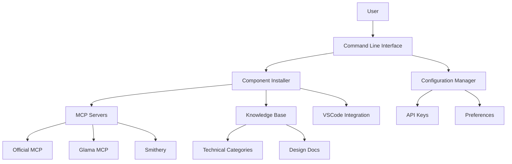

 # **Frank-MCP**

Project Document

*Based on Project Charter & Technical Design Document*  
**Version:** 2.0  
**Status:** In Development  

---

## **1. Overview**  

### **1.1 Project Summary**  

**Objective:** Develop an automated configuration tool for development environments with MCP (Model Context Protocol) servers and specialized knowledge base for backend and DevOps professionals.

**Scope:**  

- Installation and configuration of multiple MCP servers
- Creation of structured knowledge base (including Design Docs)
- Integration with VSCode
- Initial support for Ubuntu 22.04.5

**Goals:**  

- Deliver a functional POC in 3 days
- Simplify the MCP environment configuration process
- Provide foundation for future project expansion

### **1.2 Justification**

Manual configuration of MCP servers and knowledge bases is a complex and error-prone process. This tool automates this process, allowing developers to quickly leverage the benefits of LLMs in their workflow, with access to specialized knowledge and internal project documentation.

### **1.3 Project Deliverables**  

| Deliverable | Description | Deadline |
|-------------|-------------|----------|
| Initial POC | Minimum functional version | 3 days |
| Usage Documentation | Installation and usage guide | 5 days |
| Distribution Package | Installation script for Ubuntu | 7 days |

---

## **2. Technical Specification**  

### **2.1 Architecture**

### **2.2 Main Components**

#### 2.2.1 Command Line Interface

- Interactive interface using Rich for Python
- Selection menus for components and configurations
- Visual feedback during installation

#### 2.2.2 MCP Server Installer

- Support for multiple MCP implementations
- Automated configuration with user parameters
- Dependency management (Docker, etc.)

#### 2.2.3 Knowledge Base

- Directory structure organized by categories
- Templates and examples for Design Docs
- Metadata for better information retrieval

#### 2.2.4 VSCode Integration

- Automatic editor configuration
- Installation of relevant extensions
- Creation of pre-configured workspace

### **2.3 Technical Requirements**

#### 2.3.1 System Requirements

- Ubuntu 22.04.5 LTS
- Python 3.8+
- Docker and Docker Compose
- VSCode

#### 2.3.2 Dependencies

- Rich (terminal interface)
- Requests (HTTP communication)
- PyYAML (configuration file manipulation)

---

## **3. Implementation Plan**  

### **3.1 Project Phases**

#### Phase 1: POC (3 days)

- Implementation of basic CLI
- Support for at least one MCP server
- Basic knowledge base structure
- Simple VSCode integration

#### Phase 2: Refinement (post-POC)

- Support for additional MCP servers
- Knowledge base expansion
- User interface improvements
- Testing and bug fixes

#### Phase 3: Distribution (future)

- Packaging for Debian/Ubuntu repositories
- Complete documentation
- Support for additional Linux distributions

### **3.2 POC Schedule**

| Day | Activities |
|-----|------------|
| 1 | Basic project structure, CLI and MCP installer |
| 2 | Knowledge base and Design Docs structure |
| 3 | VSCode integration and final testing |

---

## **4. Knowledge Base Structure**  

### **4.1 Technical Categories**

- **Architecture**: Software architecture patterns, principles, and practices
- **LLMs**: Fundamentals, models, and applications of Large Language Models
- **DevOps**: DevOps tools, practices, and workflows
- **Python/Java/Go**: Programming language-specific resources
- **Cloud**: Cloud services and configurations (AWS, GCP, Azure)
- **Best Practices**: General guides and recommendations

### **4.2 Design Docs**

Hierarchical structure for project design documentation:

- **General**: Technical Documentation for any project developed within the team/company
- **By Project**: Main organization by project/product
- **Document Types**:
  - Architecture Documents
  - API Specifications
  - Architecture Decision Records (ADRs)
  - System Diagrams
- **Metadata**: Status, authors, dates, tags

### **4.3 Templates**

Standardized templates for different types of documentation:

- **Architecture Template**: Overview, components, interfaces
- **API Template**: Endpoints, parameters, examples
- **ADR Template**: Context, decision, consequences
- **Diagram Template**: Different system views

---

## **5. Risks and Mitigations**  

| Risk | Impact | Mitigation |
|------|--------|------------|
| Incompatibility with specific Ubuntu versions | Medium | Test on different versions, document specific requirements |
| Changes in MCP server APIs | High | Implement version checks, modular design for easier updates |
| Docker permission issues | Medium | Clear checks and instructions for group configuration |
| Hardware limitations for local models | Low | Document minimum requirements, prioritize cloud models in POC |

---

## **Annexes**  

### **A. Bibliography**  

#### Architecture & Design

- Gamma et al. "Design Patterns: Elements of Reusable Object-Oriented Software" (1994)
- Robert C. Martin. "Clean Code" (2008)  
- Eric Evans. "Domain-Driven Design" (2003)  
- Robert C. Martin. "Clean Architecture" (2017)  
- Vaughn Vernon. "Implementing Domain-Driven Design:  Tackling complexity in the heart of software." (2013)
- Richards, M. "Software architecture patterns." (2015).
- Nygard, M. "Release It!: Design and Deploy Production-Ready Software" (2018)
- Ford, N., Richards, M., Sadalage, P., & Dehghani, Z. "Building Evolutionary Architectures" (2017)

#### LLMs

- Brown et al. "Language Models are Few-Shot Learners" (GPT-3, 2020)  
- Raffel et al. "Exploring the Limits of Transfer Learning with a Unified Text-to-Text Transformer" (T5, 2020)  
- Touvron et al. "LLaMA: Open and Efficient Foundation Language Models" (Meta, 2023)  
- Chen et al. "Evaluating Large Language Models Trained on Code" (Codex, 2021)  
- Patterson et al. "Carbon Emissions and Large Neural Network Training" (2021)
- Vaswani et al. "Attention is all you need." (2017).
- Touvron et al. "Llama 2: Open foundation and fine-tuned chat models." (2023).
- Chowdhery et al. "PaLM: Scaling language modeling with pathways." (2022)
- Rae et al. "Scaling language models: Methods, analysis & insights from training Gopher." (2021)
- Wei et al. "Chain-of-Thought Prompting" (2022)
- Yao et al. "ReAct: Synergizing Reasoning and Acting" (2022)
- Schick et al. "Toolformer: Language Models Can Teach Themselves to Use Tools" (2023)
- Bubeck et al. "Sparks of Artificial General Intelligence: Early experiments with GPT-4" (2023)
- Anthropic. "Claude 2 Technical Report" (2023)

#### Autonomous Agents

- Ganguli et al. "Capacity for Moral Self-Improvement and Recursion" (2022)  
- Rea et al. "BabyAI: A Platform for Embodied AI Research" (2020)  
- Shetty et al. "Agents with Memory: Understanding and Exploring LLM-Based Agents" (2023)
- Yao et al. "ReAct: Synergizing reasoning and acting in language models." (2022)
- Weng, L. "LLM Powered Autonomous Agents." Lil'Log. <https://lilianweng.github.io/posts/2023-06-23-agent/> (2023)
- Mialon et al. "Augmented language models: a survey." (2023)

#### Prompt Engineering and Optimization

- Wei et al. "Chain-of-thought prompting elicits reasoning in large language models." (2022)
- Kojima et al. "Large language models are zero-shot reasoners." (2022)
- Wang et al. "Self-consistency improves chain of thought reasoning in language models." (2022)
- Frantar et al. "GPTQ: Accurate post-training quantization for generative pre-trained transformers." (2023)
- White, J. "A Prompt Pattern Catalog to Enhance Prompt Engineering with ChatGPT" (2023)
- Reynolds, L., & McDonell, K. "Prompt Programming for Large Language Models: Beyond the Few-Shot Paradigm" (2021)

#### Evaluation and Benchmarking

- Liang et al."Holistic evaluation of language models." (2022)
- Hendrycks et al. "Measuring massive multitask language understanding." (2021)
- Chen et al. "Evaluating large language models trained on code." (2021)

### DevOps and Infrastructure

- Burns et al. "Borg, Omega, and Kubernetes: Lessons learned from three container-management systems over a decade." (2016)
- Humble, J., & Farley, D. "Continuous delivery: reliable software releases through build, test, and deployment automation." (2010)
- Morris, K. "Infrastructure as code: Managing servers in the cloud." (2016)
- Betsy Beyer et al. "Site Reliability Engineering: How Google Runs Production Systems" (2016)
- Brendan Burns et al. "Kubernetes: Up and Running: Dive into the Future of Infrastructure" (2017)
- Brikman, Y. "Terraform: Up and Running: Writing Infrastructure as Code" 3ed. (2022)
- Gene Kim et al. "The Phoenix Project: A Novel about It, Devops, and Helping Your Business Win" (2024)
- Forsgren, N., Humble, J., & Kim, G. "Accelerate: The Science of Lean Software and DevOps" (2018)

#### Python

- Ramalho, L. "Fluent Python: Clear, Concise, and Effective Programming." 2ed. (2023)
- Downey, A. B. "Think Python: How to think like a computer scientist." (2015)
- Miguel Grinberg. "Flask Web Development: Developing Web Applications with Python." 2ed. (2018)
- Percival, H., & Gregory, B. "Architecture Patterns with Python" (2020)

#### Tools and Frameworks

- LangChain: <https://github.com/langchain/langchain>
- AutoGPT / BabyAGI (community repositories)  
- Ray Serve: <https://docs.ray.io/en/latest/serve/index.html>
- ModelContextProtocol: <https://github.com/modelcontextprotocol>

#### MCP Servers Repository

- Official: <https://github.com/modelcontextprotocol/servers>
- Glama:  <https://glama.ai/mcp/servers>
- Smithery: <https://smithery.ai/>

#### Design Documentation

- Keeling, M. "Design It!: From Programmer to Software Architect" (2017)
- Clements, P. et al. "Documenting Software Architectures: Views and Beyond" (2010)
- Fowler, M. "Patterns of Enterprise Application Architecture" (2002)
- Teles, V. M. "Software Documentation: Why It's Essential and How to Do It Well" (2021)
- Parnas, D. L., & Clements, P. C. "A rational design process: How and why to fake it" (1986)
- Allman, E. "Managing Technical Debt" (2012)
- Woods, D. "Architecture Decision Records" <https://adr.github.io/> (2020)

#### IEEE

- IEEE Std 730-2014 (SQA)
- IEEE Std 610.12-1990 (SRS)
- IEEE Std 1058-1998 (SPMP)
- IEEE Std 1016-2009 (Software Design Description)
- IEEE Std 42010-2011 (Architecture Description)

### **B. Change History**  

| Version | Date | Changes |  
|---------|------|---------|  
| 0.1.0 | 05/06/2025 | Initial version (Frank-Daemon). |  
| 0.2.0 | 05/07/2025 | Project redefinition to Frank-MCP with reduced scope and focus on environment configuration. |  

---

**Approval:**  

| Role | Name | Signature | Date |  
|------|------|-----------|------|  
| Project Manager | [Maicon de Menezes] | [Approved] | 05/07/2025 |  

---
